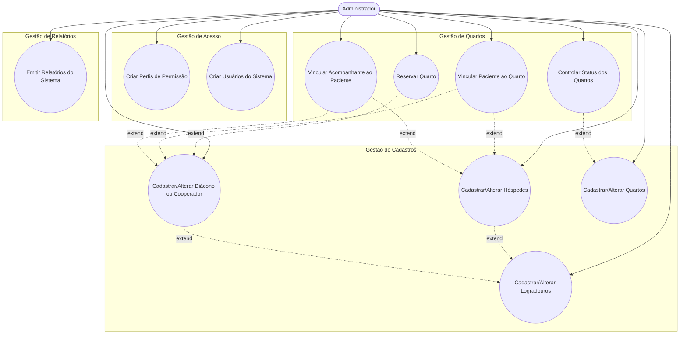

# casa-de-apoio
Sistema de gerenciamento de hóspedes da casas de apoio.

# Pitch da visão do produto
## PARA 
casas de apoio que acomodam pacientes e acompanhantes provenientes de outras cidades para realização de tratamentos médicos, procedimentos hospitalares ou períodos de internação,
## QUE
necessitam administrar de forma organizada e sistêmica o controle de quartos, hospedagens, pacientes, acompanhantes e períodos de permanência, garantindo rastreabilidade das informações, transparência administrativa e acompanhamento completo da rotina institucional,
## O
Sistema de Gestão para Casas de Apoio é um software web que permite registrar, organizar, controlar e emitir relatórios sobre toda a operação da casa de apoio, incluindo gestão de hóspedes, vínculos entre pacientes e acompanhantes, ocupação de quartos e histórico de estadias,
## AO CONTRARIO DE
* sistemas atualmente utilizados pelas casas de apoio, que apresentam limitações operacionais como a impossibilidade de alteração do vínculo de uma pessoa entre paciente e acompanhante após o cadastro, além da ausência de relatórios personalizados capazes de demonstrar a rotina da instituição, históricos de hospedagem, alterações cadastrais e vinculações entre hóspedes, quartos e períodos;  
* sistemas hospitalares tradicionais, voltados à gestão clínica e assistencial, cujo foco está em prontuários médicos, procedimentos e internações, não contemplando a dinâmica de acolhimento, hospedagem social e administração de permanência características das casas de apoio;  
* sistemas de hotelaria e hospedagem convencionais, que tratam os usuários apenas como hóspedes, sem considerar vínculos assistenciais entre paciente e acompanhante, motivos médicos da estadia, períodos relacionados a tratamentos de saúde e necessidades de prestação de contas institucionais e sociais;  
## NOSSO SISTEMA
permite cadastrar qualquer pessoa inicialmente como hóspede e vinculá-la, a qualquer momento, como paciente ou acompanhante, possibilitando alterações dinâmicas conforme a necessidade da instituição, além de oferecer controle completo da ocupação de quartos, histórico de permanência e emissão de relatórios personalizados gerais e individuais sobre períodos de hospedagem, vínculos, cadastros e alterações realizadas no sistema.

# Visão do produto detalhada  
Problema: A casa de apoio necessita administrar o controle de hóspedes (pacientes e acompanhantes).  
O sistema atual não permite emissão eficiente de relatórios personalizados nem controle simplificado da rotina.  

Público-Alvo  
*Administradores da casa de apoio  
*Funcionários responsáveis pelo cadastro e controle  
*Gestão administrativa  

Proposta de Valor - Sistema web que permite:  
*Registrar hóspedes (pacientes e acompanhantes)  
*Controlar ocupação de quartos  
*Emitir relatórios personalizados  
*Acompanhar vigência e histórico de permanência  

# Regras de negócio  

Uma casa de apoio é o local da cidade onde pessoas que estão passando por tratamentos médicos e seus acompanhantes podem se hospedar durante o tempo de internação ou tratamento. A hospedagem para acompanhantes pode acontecer desde que haja um paciente, e o paciente pode estar alocado na casa de apoio ou internado em uma unidade hospitalar.

Tanto paciente quanto o acompanhante são hóspedes do sistema. Um acompanhante só pode ser vinculado a um quarto desde que haja um paciente vinculado também.

Qualquer pessoa deve ser registrado no sistema como hóspede, e no momento em que há um vínculo com quarto ele será classificado como acompanhante ou paciente. Após o quarto ser desocupado, ele continua no sistema com registro de hóspede.

O acompanhante pode dar entrada no quarto a qualquer momento, sem necessidade do paciente estar junto presencialmente, embora o paciente precise ser vinculado no momento da entrada (basta que haja os dados do paciente para que a entrada seja efetivada).

O quarto pode ser reservado previamente, antes da data da entrada, desde que haja indicação de um Diácono. Um quarto também só pode ser ocupado mediante a solicitação do Diácono.

A alocação do quarto só se encerra no momento em que o paciente registra sua saída. O acompanhante pode sair a qualquer momento, e, também, pode haver troca de acompanhantes a qualquer momento no período em que o paciente está vinculado ao quarto, mesmo que o paciente não esteja presencialmente na casa de apoio (casos em que o paciente está internado em algum hospital).

RN: O sistema deve permitir o cadastro e atualização de hóspedes.

RN: O sistema deve guardar o registro de datas de quando um hóspede foi registrado ao sistema, e todas as datas de atualizações que sofreu.

RN: O sistema deve classificar um hóspede como paciente ou acompanhante no momento do vínculo de um paciente a um quarto. O hóspede só pode ser acompanhante se existir um paciente a quem ele será vinculado.

RN: O sistema deve guardar o registro de datas em que um hóspede foi classificado como paciente e o quarto ao qual ele foi vinculado. Também deve registrar a data de entrada do paciente no quarto e a data de saída do paciente.

RN: Um quarto pode ser reservado, mas não há obrigatoriedade de registros para relatório de reserva. Ao criar uma reserva de quarto, ela precisa constar campos obrigatórios de nome completo e cpf do solicitante e nome completo da pessoa que será paciente. Também, deve constar nome completo do diácono ou cooperador que intermedia a solicitação de reserva, e este, por sua vez, deve estar cadastrado no sistema. Também deve haver um campo de descrição, que será descrito o motivo da reserva. As informações solicitadas para preenchimento da reserva só são armazenadas na própria reserva, e não ficam registradas no sistema. Se a reserva foi desfeita, então as informações da reserva também são excluídas.

RN: Um quarto é considerado ocupado quando o seu paciente vinculado, ou algum acompanhante vinculado ao paciente registram a entrada na casa de apoio. E o quarto é considerado desocupado quando o paciente é desvinculado do mesmo.

RN: Se caso o paciente estiver internado em algum hospital da cidade, o acompanhante pode dar entrada na casa de apoio sem a presença do paciente. Mas o paciente precisa estar vinculado ao quarto do acompanhante.

RN: O paciente é vinculado ao quarto. Qualquer acompanhante deve ser vinculado ao paciente, e fica vinculado automaticamente com o quarto do paciente naquele período.

RN: O acompanhante pode registrar entrada e saída a qualquer momento do quarto. Sua saída é marcada quando ele é desvinculado do paciente. Todas as datas de vínculos e desvinculações de um acompanhante a um paciente devem ser registradas. Um mesmo acompanhante pode ser vinculado ou desvinculado do paciente várias vezes, no período em que o paciente segue vinculado ao quarto.

RN: Quando um paciente é desvinculado de um quarto, qualquer acompanhante vinculado ao paciente também é desvinculado do quarto.

# User story

## Permissões do sistema  
*US01  
Como administrador quero acesso completo a todas as funcionalidades do sistema para gerenciar em modo super usuário tudo o que acontece. Como administrador, também quero criar novos usuários do sistema e definir suas permissões. 

# Requisitos Funcionais

RF: Controle de Permissões  
*Épico: módulo cadastros  
RF: Cadastro e alterações de hóspedes  
RF: Cadastro e alterações de diácono ou cooperador  
RF: Cadastro e alterações de quartos  
RF: Cadastro e alterações de logradouros  
*Épico: módulo de gerencia de quartos  
RF: Permitir a reserva de quartos  
RF: Vincular hóspede a um quarto como paciente  
RF: Vincular um hóspede a um paciente e quarto como acompanhante  
RF: Controle de quartos ocupados, reservados e livres  
*Épico: Relatórios  
RF: Relatório de cadastros totais de hóspedes por semana, meses ou períodos personalizados  
RF: Relatório de vinculações totais de hóspedes como pacientes, por semana, meses ou períodos personalizados  
RF: Relatório de vinculações totais de hóspedes como acompanhantes, por semana, meses ou períodos personalizados  
RF: Relatório individual por hóspede, contendo todo seu histórico de alterações no sistema e vínculos atribuídos por semana, meses ou períodos personalizados  

# Caso de Uso

