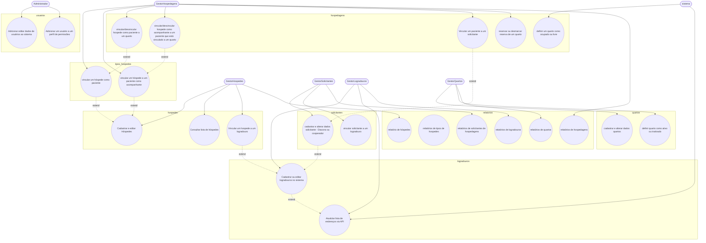

```mermaid

flowchart TB

Admin([Administrador])
GestorHospedes([GestorHospedes])
GestorHospedagens([GestorHospedagens])
GestorSolicitantes([GestorSolicitantes])
GestorLogradouros([GestorLogradouros])
GestorQuartos([GestorQuartos])
Sistema([sistema])

%% ======================
%% Epico 1 - Hóspedes
%% ======================
subgraph hospedes
    UC1((Cadastrar e editar Hóspedes))
    UC2((Consultar lista de hóspedes))
    UC4((Vincular um hospede a um logradouro))
end

%% ======================
%% Epico 2 - Logradouros
%% ======================
subgraph logradouros
    UC3((Cadastrar ou editar logradouros no sistema))
    UC5((Atualziar lista de endereços via API))
end

%% ======================
%% Epico 3 - Gestão de Solicitantes
%% ======================
subgraph solicitantes
    UC6((cadastrar e alterar dados solicitante - Diacono ou cooperador))
    UC7((vincular solicitante a um logradouro))
end

%% ======================
%% Epico 4 - Gestão de Quartos
%% ======================
subgraph quartos
    UC8((cadastrar e alterar dados quartos))
    UC9((definir quarto como ativo ou inativado))
end

%% ======================
%% Epico 5 - Gestão de Tipos de hospedes
%% ======================
subgraph tipos_hospedes
    UC10((vincular um hóspede como paciente))
    UC11((vincular um hóspede a um paciente como acompanhante))
end

%% ======================
%% Epico 6 - Gestão de hospedagens
%% ======================
subgraph hospedagens
    UC12((vincular/desvincular hospede como paciente a um quarto))
    UC13((vincular/desvincular hospede como acompanhante a um paciente que está vinculado a um quarto))
    UC14((Vincular um paciente a um solicitante))
    UC15((reservar ou desmarcar reserva de um quarto))
    UC16((definir um quarto como ocupado ou livre))
end

%% ======================
%% Epico 7 - Gestão de relatórios
%% ======================
subgraph relatorios
    UC17((relatório de hóspedes))
    UC18((relatórios de tipos de hospedes ))
    UC19((relatórios de solicitantes de hospedagens))
    UC20((relatórios de logradouros))
    UC21((relatórios de quartos))
    UC22((relatórios de hospedagens))
end

%% ======================
%% Epico 8 - Gestão de usuários
%% ======================
subgraph usuarios
    UC23((Adicionar editar dados de usuários ao sistema))
    UC24((Adicionar um usuário a um perfil de permissões))
end

%% ======================
%% Associações
%% ======================
Admin --> UC23
Admin --> UC24
GestorHospedes --> UC1
GestorHospedes --> UC2
GestorHospedes --> UC4
GestorHospedes --> UC17
GestorSolicitantes --> UC6
GestorSolicitantes --> UC7
GestorSolicitantes --> UC19
GestorLogradouros --> UC3
GestorLogradouros --> UC5
GestorLogradouros --> UC20
GestorHospedagens --> UC10
GestorHospedagens --> UC11
GestorHospedagens --> UC12
GestorHospedagens --> UC13
GestorHospedagens --> UC14
GestorHospedagens --> UC15
Sistema --> UC16
Sistema --> UC5
GestorHospedagens --> UC22
GestorQuartos --> UC8
GestorQuartos --> UC9
GestorQuartos --> UC21 

%% ======================
%% EXTENDS
%% ======================
UC4 -. extend .-> UC3
UC3 -. extend .-> UC5
UC6 -. extend .-> UC3
UC10 -. extend .-> UC1
UC11 -. extend .-> UC1
UC12 -. extend .-> UC10
UC13 -. extend .-> UC11
UC14 -. extend .-> UC6


```
